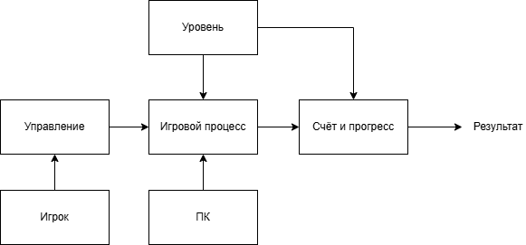
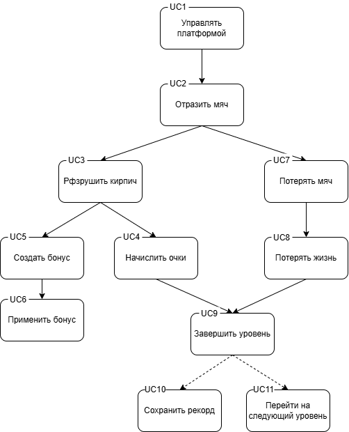

# **ARKANOID — аналитическая часть проекта**

> **Цель документа:** обосновать актуальность игры, выбрать метод анализа (SADT), зафиксировать требования.

---

## 1. Анализ рынка похожих игр

### 1.1. Arkanoid (классическая версия, Taito 1986)

**Что хорошо:** культовая механика, простая и понятная, плавное управление, бонусы (расширение платформы, многократный мяч), эффект "прилипания".

**Что плохо:** графика устарела, однообразие уровней, отсутствие прогрессии в современных терминах (достижения, рекорды), нет сохранения прогресса.

### 1.2. Breakout (Atari 1976)

**Что хорошо:** минимализм, идеальный аркадный геймплей.

**Что плохо:** слишком просто, отсутствие бонусов, очень быстро надоедает.

### 1.3. Brick Breaker (мобильные версии)

**Что хорошо:** адаптация под сенсорное управление, много уровней, система звёзд.

**Что плохо:** навязчивая реклама, донат на продолжение, часто нет сохранения между сессиями.

---

## 2. Чем ARKANOID будет актуальнее

| Критерий | Аналоги | ARKANOID |
|----------|--------|----------|
| Сохранение прогресса | Частично (только уровень) | Полное: разблокированные уровни + рекорды каждого уровня |
| Структура уровней | Линейная, однотипная | 10 уникальных раскладок (пирамида, шахматы, крепость, спираль и др.) |
| Сложность кирпичей | 1 тип прочности | 3 уровня прочности (обычные, усиленные, супер-прочные) |
| Бонусы | 2-3 типа | 3 типа: + жизнь, +3 мяча, увеличенная платформа |
| Рекорды | Общий счёт | Поуровневые рекорды + мотивация их побить |
| Визуальное разнообразие | Однообразное | Раскраска кирпичей по рядам/типам |

---

## 3. Анализ методом SADT (IDEF0)

Почему SADT?  
Процессы в игре имеют чёткую последовательность: движение → столкновение → разрушение → бонусы → счёт.

### Контекстная диаграмма (A-0):

<p align="center">
  
</p>

*Вход: управление игрока, уровень. Выход: счёт, победа/поражение.*

---

### Декомпозиция — основные процессы игры:
---

# Диаграмма вариантов использования — ARKANOID (иерархическая)

## Структура диаграммы

<p align="center">
  
</p>

---

## Описание прецедентов

### Корневой уровень

| № | Прецедент | Актор | Описание |
|---|-----------|-------|----------|
| **UC1** | Управлять платформой | Игрок | Игрок нажимает клавиши ← и → для перемещения платформы по горизонтали |

---

### Уровень 1 (физика мяча)

| № | Прецедент | Триггер | Описание |
|---|-----------|---------|----------|
| **UC2** | Отразить мяч | UC1 выполнено | Мяч сталкивается с движущейся платформой. Горизонтальная скорость меняется в зависимости от места удара (hit_pos), вертикальная инвертируется |

---

### Уровень 2 (взаимодействие с кирпичами)

| № | Прецедент | Родитель | Описание |
|---|-----------|----------|----------|
| **UC3** | Разрушить кирпич | UC2 | Мяч попадает в кирпич. Вызывает три дочерних прецедента |

**Дочерние прецеденты UC3:**

| № | Прецедент | Тип связи | Описание |
|---|-----------|-----------|----------|
| **UC4** | Начислить очки | Обязательный (всегда) | +10 очков за разрушенный кирпич |
| **UC5** | Создать бонус | Условный (каждый 5-й) | При разрушении кирпича, если счётчик разбитых кратен 5 |
| **UC7** | Потерять мяч | Условный (при промахе) | Мяч уходит за нижнюю границу экрана |

---

### Уровень 3 (бонусы и потери)

**Дочерние прецеденты UC5 (Создать бонус):**

| № | Прецедент | Тип связи | Описание |
|---|-----------|-----------|----------|
| **UC6** | Применить бонус | Обязательный | При касании бонусом платформы активируется его эффект:<br>• EXTRA_LIFE → +1 жизнь<br>• MULTI_BALL → +3 мяча<br>• BIG_PADDLE → увеличение платформы на 30 сек |

**Дочерний прецедент UC7 (Потерять мяч):**

| № | Прецедент | Тип связи | Описание |
|---|-----------|-----------|----------|
| **UC8** | Потерять жизнь | Обязательный (если мячей не осталось) | lives уменьшается на 1. При lives=0 → GAME OVER |

---

### Уровень 4 (завершение)

| № | Прецедент | Триггер | Описание |
|---|-----------|---------|----------|
| **UC9** | Завершить уровень | Все кирпичи разрушены | Вызывает два дочерних прецедента |

**Дочерние прецеденты UC9:**

| № | Прецедент | Тип связи | Описание |
|---|-----------|-----------|----------|
| **UC10** | Сохранить рекорд | Условный | Если текущий счёт выше сохранённого для этого уровня — записать в progress.json |
| **UC11** | Перейти на следующий уровень | Обязательный | Загрузить следующий уровень. Если уровень 10 пройден → победа |

---

## Таблица связей (как в SADT)

| Родитель | Дочерний | Тип связи | Условие |
|----------|----------|-----------|---------|
| UC1 | UC2 | вызывает | всегда при движении платформы |
| UC2 | UC3 | вызывает | при столкновении мяча с кирпичом |
| UC3 | UC4 | включает | всегда |
| UC3 | UC5 | включает | каждый 5-й разрушенный кирпич |
| UC3 | UC7 | включает | мяч ушёл за нижнюю границу |
| UC5 | UC6 | включает | бонус коснулся платформы |
| UC7 | UC8 | включает | мячей не осталось после потери |
| UC9 | UC10 | включает | счёт > сохранённого рекорда |
| UC9 | UC11 | включает | всегда |

---

## Потоки выполнения

### Сценарий А: обычный ход игры

```
Игрок → UC1 → UC2 → UC3 → UC4 → UC5 → UC6 → UC9 → UC10 → UC11
(очки)   (бонус) (применить)
```

### Сценарий Б: потеря мяча

```
Игрок → UC1 → UC2 → UC3 → UC7 → UC8
              (промах)  (потеря жизни)
```

### Сценарий В: полная игра до победы

```
(Повтор сценария А 10 раз)
UC9 (уровень 10) → UC11 (нет следующего) → GAME OVER (победа)
```

---

## Легенда

| Символ | Значение |
|--------|----------|
| → | Переход управления |
| UC1 → UC2 | UC1 вызывает UC2 |
| Дочерний | Выполняется внутри родительского |
| Обязательный | Выполняется всегда |
| Условный | Выполняется при выполнении условия |

---

Эта диаграмма и описание полностью соответствуют вашему image.png и могут быть вставлены в аналитическую часть проекта как **"Диаграмма вариантов использования (иерархическая)"**.
```

---

## Вывод

Проведённый анализ показал, что классические арканоидные игры имеют фундаментальные механики, но страдают от:
- Отсутствия сохранения прогресса между сессиями
- Однообразия уровней
- Примитивной системы бонусов

**ARKANOID устраняет эти недостатки:**
- Полное сохранение: разблокированные уровни + рекорды каждого уровня
- 10 уникальных раскладок кирпичей (пирамида, шахматы, крепость, спираль и др.)
- Кирпичи с 3 уровнями прочности (визуальное отличие цветом)
- 3 типа бонусов с разной редкостью
- Поуровневые рекорды — мотивация переигрывать

**SADT-анализ** позволил выделить ключевые процессы (A1–A6) и показать, что инновация проекта — не в одной функции, а в совокупности: **прогрессия + разнообразие + сохранение**.

